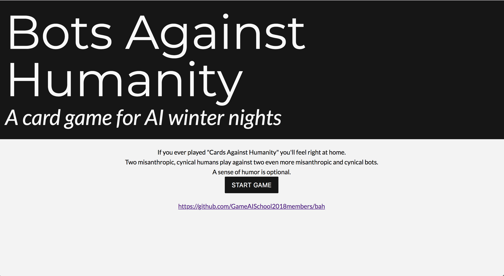
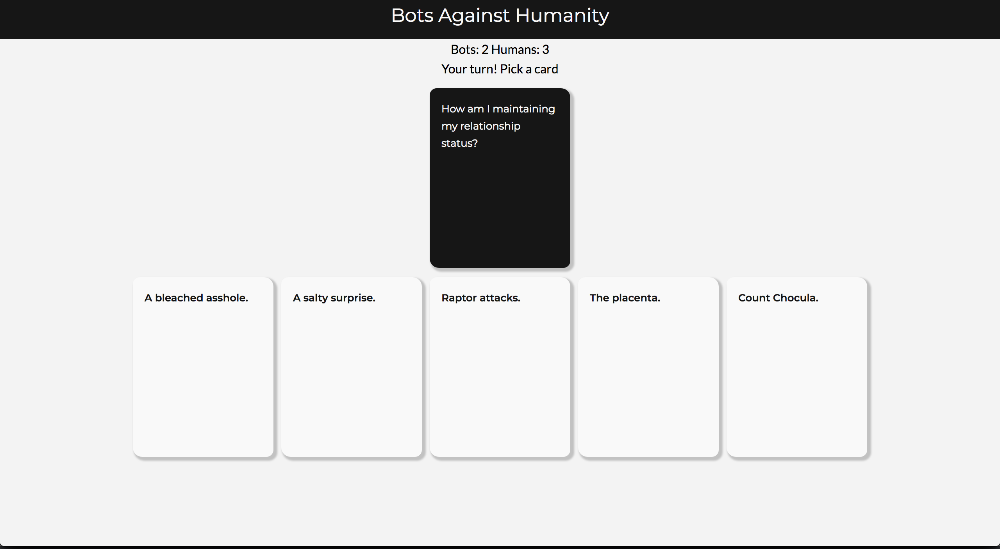
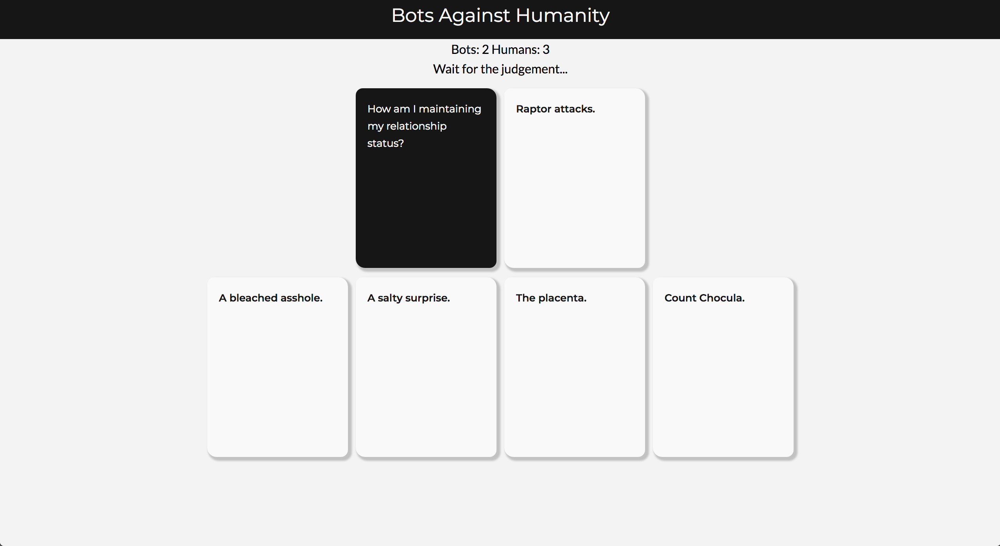
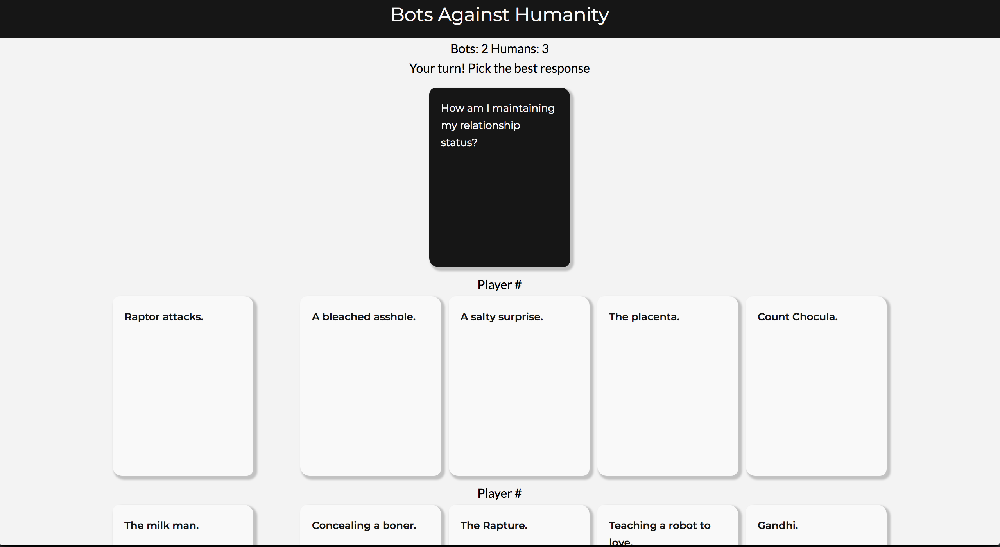
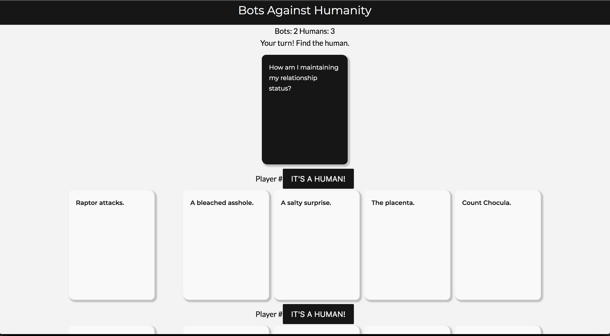

# Bots Against Humanity

A card game for AI winter nights

## Gameplay

There are 4 players, two humans and two bots. The humans are playing against the bots.

Each turn a round of "Cards Against Humanity" with a twist is played:

1. The roles are assigned randomly. One of the participants is a judge, the rest are players. You only know which one is you.
You don't know who is a human and who is a bot
2. A black card with a prompt is drawn from the deck
3. Each _player_ gets 5 white cards with possible responses
4. Each player (human or bot) picks a most appropriate (or inappropriate) white response card
5. The judge (human or bot) selects the best response 
6. If the judge is a human, they also select which player they think is a human, based on responses
7. Finally, human players then try to guess whether a judge was a human, based on the judgement

The guesses about human vs bot are not revealed until the end of the round.

Every player (human or player) get a point for the team if their response is selected as the best.

For each correct guess about the players nature, the human team gets one point. 
For  each incorrect guess the bot team gets a point.








## Overall Architecture

The game contains a few components that work together 

1. The Web Client (HTML + Javascript) - provides a player UI
2. The Backend (Firebase) - manages the game state
3. Machine Learning module (Preference Learning Toolbox) - learns how to play the game from the past data
4. Playing Bots (Python) - use different strategies (including ML model) to play online against the humans
5. NLP pipeline (Python) - extracts various features to feed to the ML module 

## Natural Language Processing

## Machine Learning

### The simple Python simulation for data collection

The purpose of the simulation is to collect the data from a human player.
There is no opponent and no objective: just pick a card that you think is funny/interesting. 
Then repeat.


Running is easy (no requirements):

```bash
python3 game.py
```

Enter the name when prompted - any string will do, it's just an id to tell different players apart. (_WE ARE FULLY GDPR-COMPLIANT!_)

Read a black card, pick a number to choose a white card, or press `q` to quit (`Ctrl-C` also works)

The game ends when it runs out of cards, and can be relaunched again, giving different choices.

All the choices data is stored in `data.csv`

That's it.